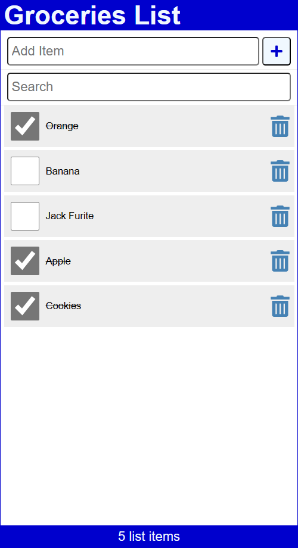
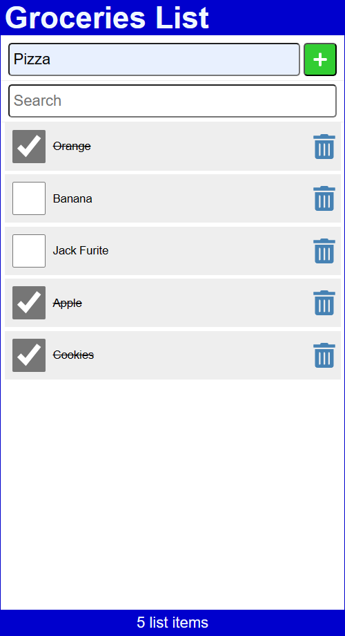

# React JS Todo List 📃

## Todo List Image

## Add Todo Image

## How to run this app in local machine

**This app is used ViteJS and json-server for runnig ReactJS and Database**
First run json-server for database `npx json-server -p 9999 -w db/db.json`
and then run Vite `npx vite --port=9000`

👉 Now go to visit [http://localhost:4000/](http://localhost:9000/)
